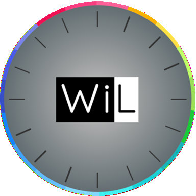

# CCEI BRiO WiL

  

Custom Home Assistant integration for **CCEI BRiO WiL** pool lighting.

Control your pool lights directly from Home Assistant via local TCP communication — no cloud required.

> **Note:** This integration uses a proprietary protocol that was reverse-engineered from the official CCEI app. It has been developed and tested with a specific hardware revision of the BRiO WiL controller. Other hardware revisions or firmware versions may use a different protocol and are **not guaranteed to be compatible**.

## Features

- **On/off control** — turn pool lights on and off
- **Brightness** — 4 levels (mapped to Home Assistant's brightness slider)
- **Light effects** — 23 modes including solid colors and animations:
  - *Solid colors:* Warm white, White, Blue, Lagoon, Cyan, Purple, Magenta, Pink, Red, Orange, Green
  - *Animations:* Gradient, Rainbow, Parade, Techno, Horizon, Hazard, Magical
- **Animation speed** — Slow, Medium, Fast (shown as a separate select entity)
- **Local communication** — direct TCP to the device on port 30302, no cloud dependency
- **Optimistic UI** — immediate feedback in the dashboard; device state is verified in the background

## Important limitations

### Single connection only

The BRiO WiL controller **only accepts one TCP connection at a time**. This means:

- If you are using the **official CCEI app** at the same time, the integration may temporarily lose its connection and the entity will become **unavailable**.
- Once the app disconnects, the integration will automatically reconnect on the next poll cycle.
- The same applies in reverse — while Home Assistant is polling, the app may briefly fail to connect.

### Proprietary protocol

This integration communicates with the device using a **proprietary, undocumented protocol** that was reverse-engineered by analyzing network traffic from the official app. There is no official API or documentation from CCEI.

This means:
- A **firmware update** from CCEI could change the protocol and break this integration.
- Other CCEI products (e.g. BRiO Z, PiCO) likely use a different protocol and are **not supported**.
- If your BRiO WiL has a different hardware or firmware revision, the protocol may differ.

## Installation

### HACS (recommended)

1. Open HACS in Home Assistant
2. Go to **Integrations** > **Custom repositories**
3. Add `https://github.com/micadez/brio-wil-ha` as an **Integration**
4. Search for "CCEI BRiO WiL" and install
5. Restart Home Assistant

### Manual

1. Copy the `custom_components/brio_wil` folder to your Home Assistant `custom_components` directory.
2. Restart Home Assistant.

## Configuration

### Initial setup

1. Go to **Settings** > **Devices & Services** > **Add Integration**
2. Search for **"CCEI BRiO WiL"**
3. Enter the **IP address** of your BRiO WiL controller
4. The integration will test the connection before completing setup

> **Tip:** Assign a static IP address to your BRiO WiL controller in your router's DHCP settings to prevent the IP from changing.

### Options

After setup, you can adjust polling and retry behavior under **Settings** > **Devices & Services** > **CCEI BRiO WiL** > **Configure**:

| Option | Default | Range | Description |
|:--|:--|:--|:--|
| **Poll interval** | 600s (10 min) | 10s – 24h | How often the integration checks the device state |
| **Retry interval** | 60s | 5s – 1h | Initial wait time after a failed connection |
| **Max retry interval** | 3600s (1h) | 1 min – 24h | Upper limit for exponential backoff |

When the device is unreachable, the integration uses **exponential backoff**: the retry interval doubles after each failure (60s → 120s → 240s → ...) up to the configured maximum. Once the device responds again, polling returns to the normal interval.

## Entities

The integration creates two entities:

| Entity | Type | Description |
|:--|:--|:--|
| **Pool Light** | Light | On/off, brightness (4 levels), effect selection (23 modes) |
| **Speed** | Select | Animation speed: Slow, Medium, or Fast |

## Troubleshooting

| Problem | Cause | Solution |
|:--|:--|:--|
| Entity shows "Unavailable" | Device is offline or another app is connected | Close the CCEI app and wait for the next poll cycle |
| Cannot connect during setup | Wrong IP or device not powered on | Verify the IP address and that the controller is on |
| State not updating | Poll interval too long | Reduce the poll interval in integration options |
| Entity flickers between available/unavailable | App and integration competing for connection | Avoid using the app and HA simultaneously |
